# PKI-Auth

A Password less authentication protocol built using PKI and Linked Data Signature to protect user data. The protocol accomplishes the following two goals:

> How passworldless solution can be implemented using Public Key Infrastructue and become better alternative of password based authentications. 

> How PKI based solution can protect the User's data by not letting the server store the user's personal information but still be able to use the application the way it was being used earlier. 

The protocol uses Linked Data Signature and JSON Web Token as its core concepts along with JSON-ld as message format. 

## Protocol

### Registration

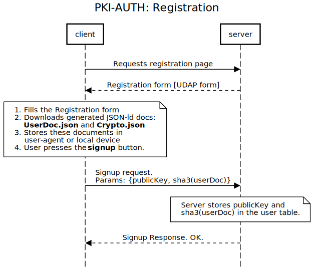

- [Source](https://sequencediagram.org/index.html#initialData=C4S2BsFMAIAUGkCSBaAggVQCoAkBc0AlSAcxAGdgAnAQ1AHsA7AKCYAdrLQBjEdh4aF3AhI-Nh269q-aGUiUAbvJZCR-ZAD45i+fiIBHAK6QKZaJRLkqtEI2jtikJtqWVoyTatHA9lijXoGaAAzOkoAW2gAbXQAEVRYELDwgF0mBjpgGDpXQWFvXABGADpoADEQcHAzYAALGCJSfxs7UIjoAB0GACZS2LoAdwZwOmoAEzNHBnlaSDHoACkAZQB5ADlkcHmxui4yXC7oI+gAKhP0bX6uYoArMkYz6Gl5s4BhSgBPVmA6W-uGM5dADMpSWPwsNXqcmgOy4hnC3jMIAYh2Ohm0yGoUwEYWgIy41HAMMgChAXEgXQALKULvJ7BC5JCYGcyCBiAxDKxHgAjQzAH4MUoqfIyTSyeSufBLNkc1jmSBGEzAYpdWAcajhfbQADerEM3OEXHgkA+ABpZLVqECABTo+RXACUAF90plsrkXLpoEsJXSKGETPZ9YbjR8ngwxl0yJabXbKI7oMjoHUYHHk9QDZBis5fW4PBovPwpTLOYQTKxGHJSit4NmmEA)

### Authentication

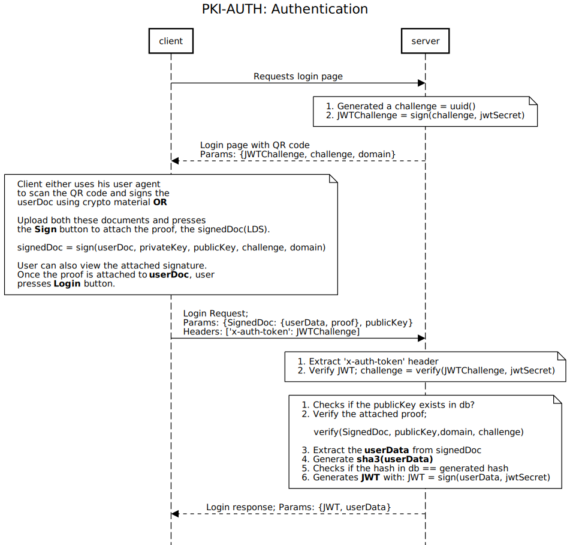

- [Source](https://sequencediagram.org/index.html#initialData=C4S2BsFMAIAUGkCSBaAggVQCoAkBc1UBXYAC0gDtQBjAQ1AHtyAoJgBxoCdqR3LorwICsDaduvYNADOkDgDdZLAUMrIAfDPmz8AJUgBHQpCnAp0cPQDmIctHaXITcvWAx6CjtNkfcARgB00ADiFLJ0kAAm0DT8JDTgUOQO0AC80ISEIBEAFACUADrkAEyBAFIA6pgAwnEJFMlpUiCW5NlUtYkOADTQAFYA7sAAypBUHJDAuUyaHtDI6vyCwrgAMlY2djTJ-WAk0ACKOvz0EZCFsJw0ALZS+ADeFdUd9ZA97fGdr9AR9Fc0NgBfJwuNyzZTLKpLPiQXaydIyMwkEBmQiaaIOSiFYD0aS0WykGCHY6naLkKJNFpmAmFVGyAAi9Co8Jsln4HAAnqxsdA-q4OCB4tAAFRCgDyOhFhUK6FYFhoUQARi49gSZN9GYQrsIzDQyXZxlIEViyMKhUNmuQRdAFcRsficXRgDR2tACfr6PQAGY9N0U8iRBlUbIrOlDXL+KXkP0BxmpaQW7K0jiBnqsflycLwSDs1OEBWCKhZnOxD4vHo-P42ArkaVovHRcBSHFyIT9V0mx3Osjki10QjjCPkUXkKgwN1pj2e6DI6LAJ3tSKunEipOBkU9JOFNPGBGmtbWS1C622xiBJjgvjqGbafcbPSGYzAADc50uN3u5paMao91XdBoqYcJOAK5vmICFtmAKFNgkDyrItzQAA2gA5AAHsgNDECQyDYgA1hQyH4I8NSlkkkAALrAq40DuHC14cH4gQAKKocAHDOpIaEYVhOH0Ph5DIdAZBwRwhQlNAABqsggJ67LQI8T4lnUZFxh4MnstkxHPGRPQDMMozjJMVGgnR3jaAE0A1KMuFmDJ7YwKweYFkW0CQKhyKmNOtgRAqAD8YmBFJ-KyfZs7zt27peopkbQLF0BqbJ2Sfv6EQpnYTngUWXQVv85BvNpDjVoUADMzGsexVCSG6K6aHS-5Wp6QFXPGX6pYyhQACyBCE-rsdRIpSHExWJrV-65JK5AAKyBFZVA2dOU5unEg1ed8CqpGkGJhK4UTLSQhQAGzdaEfXGKajxWjspBEZUcZ+iN9L-rpgwjGMExTPRczqBewD4LetgGqwjAyIpFzse+0APJUG6jU6QIsEwQA)

### Authorization

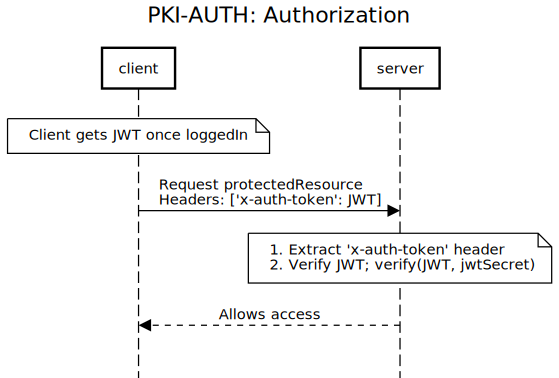

- [Source](https://sequencediagram.org/index.html#initialData=C4S2BsFMAIAUGkCSBaAggVQCoAkBc1UBXYACwHsAnEALwENQyA7AKGYAdaLQBjEDx4NG7gQkAe048+tAdADOkCgDdFrRmWAwyKikJFjg+AML7ZAc0jA50AFIB1TNCbcY4MmYsATRC2GiByAB8CsqKuABKkACOhJBygmwUGpDcmp6RcmSEFC4AOozYkLSeinL4ANoA5AAeyLTEJMjAZADWYpX49pgAuszqmk468oo6uACMAHTQAKLVwBS0qdA1dQ1Nre3QJEUlFPkATFMAaoogAGYAnrYOANzQOucXABRdADTQAFYA7sAAyikUSwASmYISGyCCfgM+FQ4DcX2sixccjkrCAA)


### Evaluation Metrics

* Trust
* Data Protection
* Usability
* Security

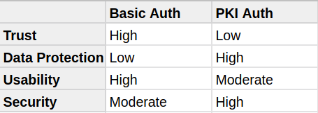

## Demo 

Follow the [instructions](#installation--usage) to run the `client` and `server` applications. First setup and run the server then run the client. Once it runs successfully, the client app can be accessed on `http://localhost:8080/` url. The tool supports two types of authentications; BASIC-AUTH (username/password based) and PKI-AUTH (passwordless).

### Basic Authentication

#### Registration & Login

Registration | Login
------------ | ------
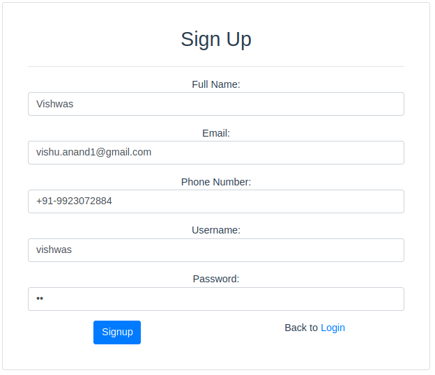 | 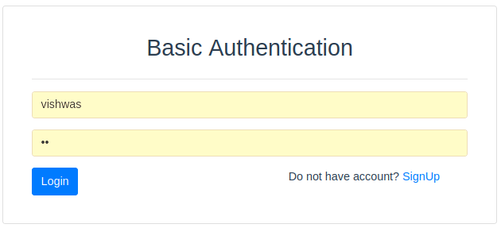

Register a use by filling the registration form and then go to login page to login into the website. On successfull login, the user is taken into `home` page which show user profile. 

#### Inside Database

Let us take a look into database when registered by this mechanism. 


As you can clearly see user personal information sitting in the database. 

### PKI Authentication

Now, go back to the login page [http://localhost:8080/login] but this time lets use `PKI-Auth`. But before that, lets register a user. 

#### Registration

To register a user go to register page [http://localhost:8080/register_pki] and fill the form.

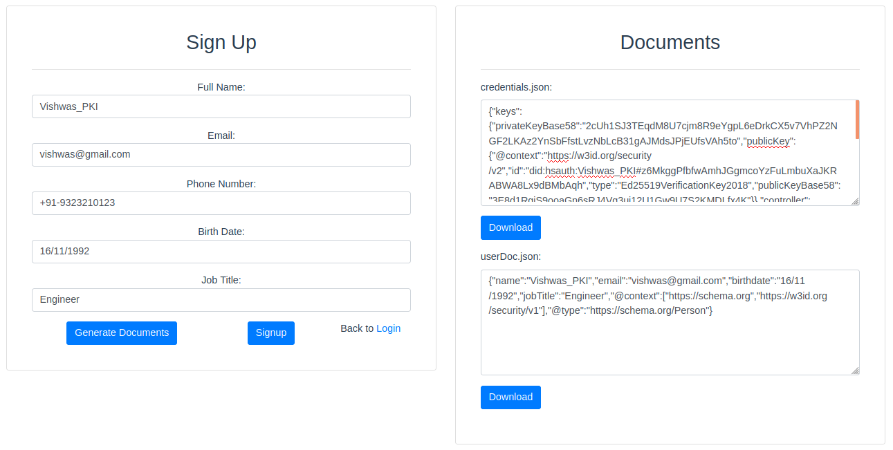

##### User Doc & Crypto Material [JSON-ld]

Once the form is filled, you can download crypto materials (`credential.json`) and user doc (`userDoc.json`). Note that you are not yet signedup. 

User doc | Credential doc
---------|---------------
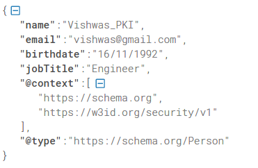 | 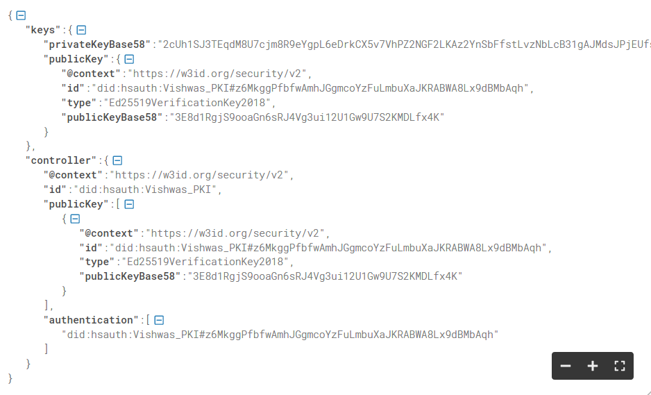

To signup, press on **SignUp** button. If you are redirected back to login page, meaning, you are signedup. Let's take a look at the db again.

#### Inside Database

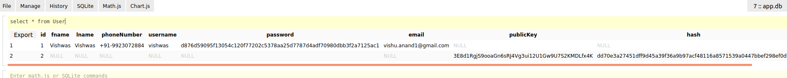

As you can see in the db (the second row), none of user personal information went into it. Only the `publickey` and `hash` of userData resides - Quite safe huh!

#### Login

To login using `PKI-auth`, you either need a wallet to scan the QR code or, just provide crypto material doc and userDoc. You can click on **View Proof** button to see (optional) what signature got added to the userDoc. Finally click on **Login** button to go to user profile page.

Login | Proof
------|-------
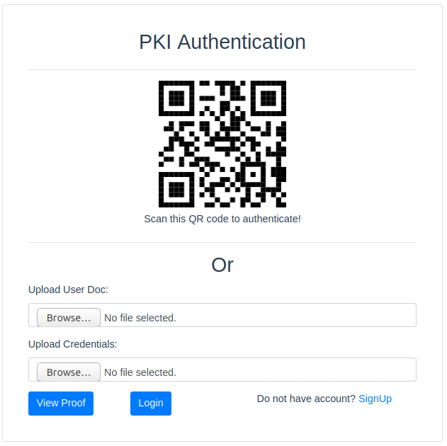 | 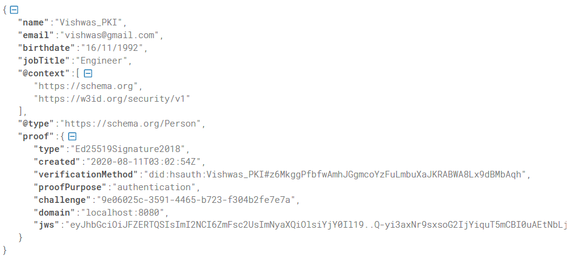

## Installation & Usage

### Client

```js
cd client
npm i
npm run serve
```

### Server

```js
cd server
npm i
npm run newdb // to setup database. Do not run this everytime. 
npm run dev
npm run build
npm run test
npm run start 
```

## APIs

- `api/auth/register`: To register a user
- `api/auth/login`: Tp authenticate a user
- `api/auth/verify`: Verifies the authToken passed in header for client
- `api/blog/created`: Protected with JSON web token
- `api/blog/challenge`: To get a new challenge
