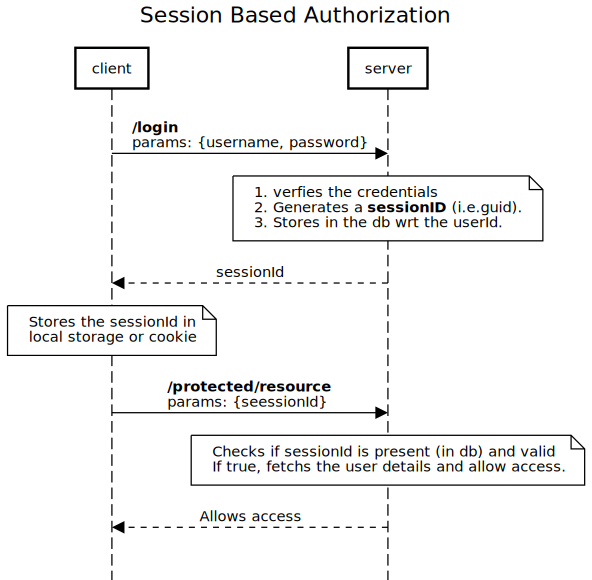

# JWT Demo

JSON Web Tokens

## Authorization

### Session based authorization



- [Source](https://sequencediagram.org/index.html#initialData=C4S2BsFMAIGVIM4JAewHbQEIEMGQCbQCCArsABYoBOIAXtqOgFBMAO2VoAxiO2sNC7gQkfmw7de2ftDxUAbpCoshImQFoAfHMVUAXNABUhgPTgUAcxBpjAHTTsq2ALYIDAbxJy0LyABpodiQAd2p8AF8mNBRgGBRdWSVdPQBGADpoXQAzEQRoChguKgJRUGxwBHsAJgyAcVElBkRobCNDPCRUNABJABFjaAAKEDTINIsSEHwASjT7AGYM2GBqZut88hh8ACNoYM4NmC8lbvw0ph0laHUtVVKDDuR0U5Zo2Oh4q7v+A2XVvIKiU6z0I1ns5i45VkKycFjiVEEKBQAGsRCphKUtJd9G0TKwqDFIFxYvgTMUECgSFQuJA7A4OC43NB3HhEE8ehFoK9CR8EtiDABhTZcZF5EBZIHs07QEB5fGIUpDdY7aYtNCEeTlKb2boS4BUEj+aBZSDALjkAGbaDHBH4U3YEAVNWEcrmYItLg0pDnC5JK43TTfYAGIjgN15bCetlAA)

### JWT based authorization


- [Source](https://sequencediagram.org/index.html#initialData=C4S2BsFMAICkHUAq0BCBDAzpAJtAggK7AAWA9gE4gBeaopAdgFCMAOa5oAxiG-cNJ3AhIfVuy480faFnIA3SOWaDh0gLQA+WQvIAuaACoDAenCkA5iHpGAOvTbk0AWwz6A3gVn1nkADTQ2DAwAdwpsAF9GelJgGFIdGUUdXQBGADpoHQAzYQxoEhhOchwRUDRwDDsAJgyAcRFFWkg8tEMDACtg4CNoTytzXtk1bFpWqVwjLCLIYDUAa0gATyNGbUVoNU0VUv1YAGUAeQA5aHhIACNoRFIF+gAKTuAASmZo2Oh49e2+fT3gCma+WIMEe0CsdjMnHKMn+jnMcXIAlIN2EyiEpU0az0bWMLHIMUgnFi2GMxQwpAI5E4kFs9GBaGwilc0Dcj3C0FeBI+CSx+nS0AAaooQDlAQU4Eh8jcRIN+m0psVZgtlgZoONoFkZpxgXk7J5FMNRhr8U4gTB-rcwcAsOAsswsRstuifvhwGZgi1ONSgkA)


### Concepts 

Ex.:
```
eyJhbGciOiJIUzI1NiIsInR5cCI6IkpXVCJ9.eyJpZCI6NCwiZm5hbWUiOiJBbWl0IiwibG5hbWUiOiJsdW1hciIsInBob25lTnVtYmVyIjoiYTEyMTIzMTIzIiwidXNlcm5hbWUiOiJ2aXNod2FzMTIxMiIsInBhc3N3b3JkIjoicGFzc3dvcmQiLCJlbWFpbCI6InZpc2h1LmFuYW5kMUBnbWFpbC5jb20iLCJwdWJsaWNLZXkiOiJha19ETlpBQzJkZTVHZm9qb2t3dnJyNjloV3B0WGdRV2JmaE0yY3VKcXVNTEY4Z2NNZXc4IiwicHJpdmF0ZUtleSI6IjViMzAyZmFkMGMzY2VhZjVjZjljYWU2NjcxNWMzM2FhNGMyOWYyNGJhMTIxOTM4OWQzZjRjYzA4ZjBhZjdiMmYxYzE3NWYyZTJkYzIzYjQ2NDlkNGU3NTM4Y2QzNjk4ZjUxNjM1MDA5MzlkOTU5ZGVlYWNiYTIwODU1MDRhOTM0IiwiaWF0IjoxNTk2NzEwMTU4LCJleHAiOjE1OTY3MTAxODh9.21eFqfCSzPNvy5LfUwoWh5EqMoL1eHdGJumCIts1akg
```

It had three parts (note the `.` in the token acting as a sepatators):
1. **JWT Header**: Header contains the meta information of the token. 
    * It contains two parts:
        * Signing Algorithm 
        * Type of the token
    * Ex.: {"typ":"JWT","alg":"HS256"}
2. **JWT Payload**: Payload is the part where all the user data is added and this data is referred to as claims. Claims are readable by anyone.
    * There are 3 types of claims:
        * Registered claims: Ex. `Issuer`, `Subject`, `Audience`, `Expiration Time` etc.
        * Public claims: 
        * Private claims: Ex: {name: ‘’, role: ‘ROLE_USER’}
3. **JWT Signature**: Signature is a hash, derived from encoded header and payload using a hashing algorithm (defined in header) with a secret key.

### Benifits

- In session based, for every request, a db call has to made inorder to validate the sessionid. whereas in jwt it is not required.
- Multi server authorization can be easily implemented using jwt. Imagine there are two server (may be microservices) where you might want your user to get authenticated at one server and get the token and then use the same token to acess the second server without having him to re-authenticate for authorization (unlinke session based). 
- For this all you need to do this is, share the `secretkey` with the other sever. Further public key cryprtograhy can also be used to sign and verify the message instead of shared `secretkey`.


### Installation

```js
npm i
npm run newdb // to setup database. Do not run this everytime. 
npm run dev
npm run build
npm run test
npm run start 
```

### APIs

- `api/auth/register`
- `api/auth/login`
- `api/auth/verify` : Verifies the authToken passed in header for client
- `api/blog/created`: Protected with JSON web token
